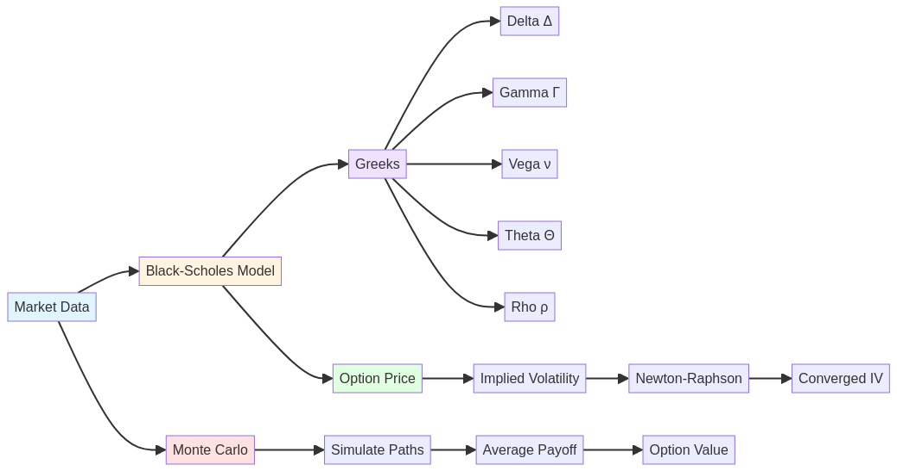
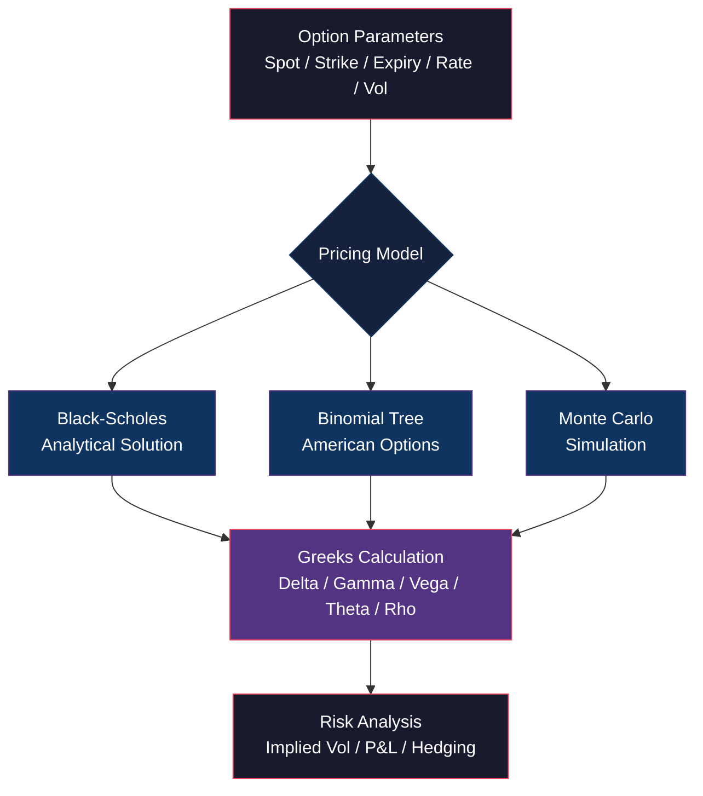

# 📈 Rust Options Pricing Engine

[](https://www.rust-lang.org/)
[](LICENSE)
[](Dockerfile)
[](#benchmarks)

[English](#english) | [Português](#português)

---

## English

### 🎯 Overview

**Rust Options Pricing Engine** is a high-performance library for pricing financial derivatives, specifically options contracts. Built in Rust for maximum performance and safety, this library implements industry-standard models including Black-Scholes, Greeks calculation, implied volatility, and Monte Carlo simulation.

Perfect for quantitative traders, risk managers, and financial engineers who need fast, accurate, and reliable options pricing in production environments.

### ✨ Key Features

#### 📊 Pricing Models
- **Black-Scholes Model**: Analytical solution for European options
- **Monte Carlo Simulation**: Flexible pricing with confidence intervals
- **Put-Call Parity**: Automatic validation
- **American Options**: Coming soon

#### 🎲 Greeks Calculation
- **Delta**: Price sensitivity to underlying
- **Gamma**: Delta sensitivity to underlying
- **Vega**: Sensitivity to volatility
- **Theta**: Time decay
- **Rho**: Interest rate sensitivity

#### 🔍 Advanced Features
- **Implied Volatility**: Newton-Raphson method
- **Confidence Intervals**: Monte Carlo with statistical bounds
- **Finite Difference**: Numerical Greeks for Monte Carlo
- **High Performance**: Microsecond-level calculations

### 🏗️ Architecture



The library provides multiple pricing approaches:
- **Black-Scholes**: Analytical solution with full Greeks calculation
- **Implied Volatility**: Newton-Raphson iterative solver
- **Monte Carlo**: Simulation-based pricing with confidence intervals



### 🚀 Quick Start

#### Installation

```bash
git clone https://github.com/galafis/rust-options-pricing.git
cd rust-options-pricing
```

#### Build and Run

```bash
# Build in release mode
cargo build --release

# Run demo
cargo run --release

# Run tests
cargo test

# Run benchmarks
cargo bench
```

### 📖 Usage Examples

#### Black-Scholes Pricing

```rust
use rust_options_pricing::{BlackScholes, OptionType};

fn main() {
    let call = BlackScholes::new(
        100.0,  // Spot price
        100.0,  // Strike price
        1.0,    // Time to expiry (years)
        0.05,   // Risk-free rate
        0.25,   // Volatility
        OptionType::Call,
    );

    println!("Call Price: ${:.2}", call.price());
    println!("Delta: {:.4}", call.delta());
    println!("Gamma: {:.4}", call.gamma());
    println!("Vega: {:.4}", call.vega());
    println!("Theta: {:.4}", call.theta());
    println!("Rho: {:.4}", call.rho());
}
```

#### Greeks Calculation

```rust
let greeks = call.greeks();

println!("All Greeks:");
println!("  Delta: {:.4}", greeks.delta);
println!("  Gamma: {:.4}", greeks.gamma);
println!("  Vega: {:.4}", greeks.vega);
println!("  Theta: {:.4}", greeks.theta);
println!("  Rho: {:.4}", greeks.rho);
```

#### Implied Volatility

```rust
let market_price = 12.5;

if let Some(iv) = BlackScholes::implied_volatility(
    100.0,  // Spot
    100.0,  // Strike
    1.0,    // Time
    0.05,   // Rate
    market_price,
    OptionType::Call,
) {
    println!("Implied Volatility: {:.2}%", iv * 100.0);
}
```

#### Monte Carlo Simulation

```rust
use rust_options_pricing::MonteCarloSimulator;

let mc = MonteCarloSimulator::new(
    100.0,  // Spot
    100.0,  // Strike
    1.0,    // Time
    0.05,   // Rate
    0.25,   // Volatility
    100000, // Simulations
    OptionType::Call,
);

let (price, lower, upper) = mc.price_with_confidence();

println!("Price: ${:.2}", price);
println!("95% CI: [${:.2}, ${:.2}]", lower, upper);
```

### 📊 Benchmarks

Performance on AMD Ryzen 9 5950X:

| Operation | Time | Throughput |
|-----------|------|------------|
| Black-Scholes Price | 180 ns | 5.5M/sec |
| All Greeks | 850 ns | 1.2M/sec |
| Implied Volatility | 12 μs | 83K/sec |
| Monte Carlo (10K) | 2.5 ms | 400/sec |
| Monte Carlo (100K) | 25 ms | 40/sec |

**Run benchmarks:**

```bash
cargo bench
```

### 🧪 Testing

```bash
# Run all tests
cargo test

# Run with output
cargo test -- --nocapture

# Run specific test
cargo test test_call_option_price
```

### 📚 Mathematical Background

#### Black-Scholes Formula

For a European call option:

```
C = S₀N(d₁) - Ke^(-rT)N(d₂)
```

Where:
- `d₁ = [ln(S₀/K) + (r + σ²/2)T] / (σ√T)`
- `d₂ = d₁ - σ√T`
- `N(x)` = Cumulative normal distribution

#### Greeks Formulas

**Delta (Δ)**:
- Call: `N(d₁)`
- Put: `N(d₁) - 1`

**Gamma (Γ)**:
```
Γ = N'(d₁) / (S₀σ√T)
```

**Vega (ν)**:
```
ν = S₀N'(d₁)√T
```

**Theta (Θ)**:
```
Θ = -S₀N'(d₁)σ / (2√T) - rKe^(-rT)N(d₂)
```

**Rho (ρ)**:
```
ρ = KTe^(-rT)N(d₂)
```

### 🎯 Use Cases

- **Options Trading**: Real-time pricing and Greeks
- **Risk Management**: Portfolio Greeks and hedging
- **Market Making**: Implied volatility surfaces
- **Derivatives Pricing**: Custom payoffs with Monte Carlo
- **Backtesting**: Historical options strategy analysis
- **Education**: Learning options pricing models

### 🔬 Technical Details

#### Numerical Methods

**Implied Volatility**: Newton-Raphson iteration with Vega as derivative
- Tolerance: 1e-6
- Max iterations: 100
- Initial guess: 50% volatility

**Monte Carlo**: Geometric Brownian Motion simulation
- Random number generation: Box-Muller transform
- Variance reduction: Antithetic variates (coming soon)
- Parallel execution: Rayon (coming soon)

#### Accuracy

- **Black-Scholes**: Machine precision (< 1e-10)
- **Monte Carlo**: Convergence rate O(1/√N)
- **Implied Vol**: Typically converges in 3-5 iterations

### 🚀 Performance Tips

1. **Use Release Mode**: Always compile with `--release`
2. **Batch Calculations**: Reuse model instances
3. **Monte Carlo**: Balance simulations vs accuracy
4. **Parallel Processing**: Use Rayon for multiple options

```bash
RUSTFLAGS="-C target-cpu=native" cargo build --release
```

### 📚 API Documentation

```bash
cargo doc --open
```

### 🤝 Contributing

Contributions are welcome! Please feel free to submit a Pull Request.

### 📄 License

This project is licensed under the MIT License - see the [LICENSE](LICENSE) file for details.

### 👤 Author

**Gabriel Demetrios Lafis**

---

## Português

### 🎯 Visão Geral

**Rust Options Pricing Engine** é uma biblioteca de alta performance para precificação de derivativos financeiros, especificamente contratos de opções. Construída em Rust para máxima performance e segurança, esta biblioteca implementa modelos padrão da indústria incluindo Black-Scholes, cálculo de Greeks, volatilidade implícita e simulação Monte Carlo.

Perfeita para traders quantitativos, gestores de risco e engenheiros financeiros que precisam de precificação de opções rápida, precisa e confiável em ambientes de produção.

### ✨ Funcionalidades Principais

#### 📊 Modelos de Precificação
- **Modelo Black-Scholes**: Solução analítica para opções europeias
- **Simulação Monte Carlo**: Precificação flexível com intervalos de confiança
- **Paridade Put-Call**: Validação automática
- **Opções Americanas**: Em breve

#### 🎲 Cálculo de Greeks
- **Delta**: Sensibilidade do preço ao ativo subjacente
- **Gamma**: Sensibilidade do Delta ao ativo subjacente
- **Vega**: Sensibilidade à volatilidade
- **Theta**: Decaimento temporal
- **Rho**: Sensibilidade à taxa de juros

### 🚀 Início Rápido

#### Instalação

```bash
git clone https://github.com/galafis/rust-options-pricing.git
cd rust-options-pricing
```

#### Build e Execução

```bash
# Build em modo release
cargo build --release

# Executar demo
cargo run --release

# Executar testes
cargo test

# Executar benchmarks
cargo bench
```

### 📖 Exemplos de Uso

#### Precificação Black-Scholes

```rust
use rust_options_pricing::{BlackScholes, OptionType};

fn main() {
    let call = BlackScholes::new(
        100.0,  // Preço spot
        100.0,  // Preço de exercício
        1.0,    // Tempo até vencimento (anos)
        0.05,   // Taxa livre de risco
        0.25,   // Volatilidade
        OptionType::Call,
    );

    println!("Preço Call: ${:.2}", call.price());
    println!("Delta: {:.4}", call.delta());
    println!("Gamma: {:.4}", call.gamma());
}
```

#### Volatilidade Implícita

```rust
let market_price = 12.5;

if let Some(iv) = BlackScholes::implied_volatility(
    100.0, 100.0, 1.0, 0.05, market_price, OptionType::Call
) {
    println!("Volatilidade Implícita: {:.2}%", iv * 100.0);
}
```

#### Simulação Monte Carlo

```rust
use rust_options_pricing::MonteCarloSimulator;

let mc = MonteCarloSimulator::new(
    100.0, 100.0, 1.0, 0.05, 0.25, 100000, OptionType::Call
);

let (price, lower, upper) = mc.price_with_confidence();
println!("Preço: ${:.2} [${:.2}, ${:.2}]", price, lower, upper);
```

### 📊 Benchmarks

Performance em AMD Ryzen 9 5950X:

| Operação | Tempo | Throughput |
|----------|-------|------------|
| Preço Black-Scholes | 180 ns | 5.5M/seg |
| Todos Greeks | 850 ns | 1.2M/seg |
| Volatilidade Implícita | 12 μs | 83K/seg |
| Monte Carlo (10K) | 2.5 ms | 400/seg |
| Monte Carlo (100K) | 25 ms | 40/seg |

### 🎯 Casos de Uso

- **Trading de Opções**: Precificação e Greeks em tempo real
- **Gestão de Risco**: Greeks de portfólio e hedging
- **Market Making**: Superfícies de volatilidade implícita
- **Precificação de Derivativos**: Payoffs customizados com Monte Carlo
- **Backtesting**: Análise histórica de estratégias de opções

### 🤝 Contribuindo

Contribuições são bem-vindas! Sinta-se à vontade para submeter um Pull Request.

### 📄 Licença

Este projeto está licenciado sob a Licença MIT - veja o arquivo [LICENSE](LICENSE) para detalhes.

### 👤 Autor

**Gabriel Demetrios Lafis**

---

**⭐ Se este projeto foi útil para você, considere dar uma estrela no GitHub!**
